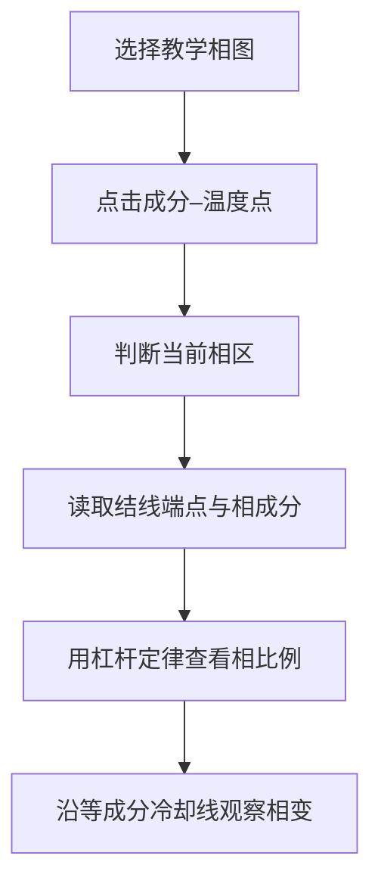

# PhaseDiagramTutor

**在二元相图上选一个成分和温度，读出相组成、结线、杠杆定律和冷却过程。**

A Chinese interactive teaching workbench for binary temperature–composition diagrams. Materials students can connect a point on a diagram to the phases present, their compositions and fractions, then follow an isopleth on cooling.

[启动工作台](#运行) · [五张内置相图](#内置相图) · [解释器与界面](#结构) · [教学范围](#范围)

[](LICENSE) [](pyproject.toml)



第一次使用可选 **Cu–Ni 完全互溶**，先在单相区与两相区各点一次，再用成分/温度滑条移动。右侧同时给出相区、结线与冷却线解释；“导学路径”按步骤引导。

内置曲线和不变点用于教学。具体合金的工艺或研究判断仍应依据原始文献和适用相图；本工具不执行 CALPHAD 计算。

## 运行

```powershell
git clone https://github.com/D-sudoasd/PhaseDiagramTutor.git
cd PhaseDiagramTutor
py -3 -m venv .venv
.\.venv\Scripts\python -m pip install -r requirements.txt
.\.venv\Scripts\streamlit run app.py
```

或一键：

```powershell
.\run.ps1
```

（`run.ps1` 会在缺少 `.venv` 时创建环境并安装依赖，然后以 `streamlit run app.py --server.headless true` 启动。）

Linux / macOS：

```bash
python3 -m venv .venv
source .venv/bin/activate
python -m pip install -r requirements.txt
streamlit run app.py
```

也可：`python -m pip install -e .`（见 `pyproject.toml`），再 `streamlit run app.py`。

测试：

```powershell
.\.venv\Scripts\python -m pytest
```

浏览器打开后：选一张图或走「导学路径」。**在相区内部点一下**放置当前点（点在内部，不会吸到相界顶点）；精细移动用图下方的成分 / 温度条。右侧三块始终可见——**现在有哪些相**、**结线与杠杆定律**、**沿冷却线往下走**。长说明在展开栏里，不盖住相区。

依赖：Streamlit、Plotly、NumPy（`requirements.txt` / `pyproject.toml`）。

## 内置相图

| 图 | 用来建立什么直觉 |
|---|---|
| Cu–Ni 完全互溶 | 液相线 / 固相线、单相区 |
| Pb–Sn 简单共晶 | 共晶水平线、先析出相 |
| 简单包晶（示意） | L+α → β |
| Fe–Fe₃C 亚稳相图 | 钢 / 铸铁、珠光体、奥氏体化 |
| Ti–V β 稳定示意 | β transus、α+β 窗口（不是 Ti-6Al-4V 精确截面） |

Fe–Fe₃C 与解释器共用同一套数，不混手册：

- 共析 0.76 wt% C / 727 °C
- 共晶 4.30 wt% C / 1148 °C
- 包晶 1495 °C（δ 0.09、γ 0.17、L 0.53 wt% C）
- E 点 2.11 wt% C（钢 / 铸铁分界）

## 结构

```text
app.py                 Streamlit 入口（中文工作台）
src/phase_tutor/
  interpreter.py       相区、结线、杠杆、相律、冷却线（无 UI）
  figure.py            Plotly 相图 + 结线/杠杆标注
  readout.py           中文读出与冷却跳转温度
  diagrams/            五张内置 T–x 几何
  tutorial.py          导学六步（同一套解释器）
tests/                 pytest + Streamlit AppTest
```

解释器与作图分离：界面只展示 `interpret` / `walk_isopleth` 的结果。

## 范围

| 做 | 不做 |
| --- | --- |
| 二元 T–x 读点、结线、杠杆定律 | 三元相图 |
| 等成分冷却、共晶 / 包晶 / 共析直觉 | TTT / CCT |
| 教学拓扑与导学路径 | Gibbs 能量最小化、CALPHAD 数据库 |
| | 商业牌号精确截面 |

内置温度与成分是教材常用示意值；发表或工艺决策请对照原始文献 / 商业软件 / 手册。

## 许可

MIT。见 [LICENSE](LICENSE)。
